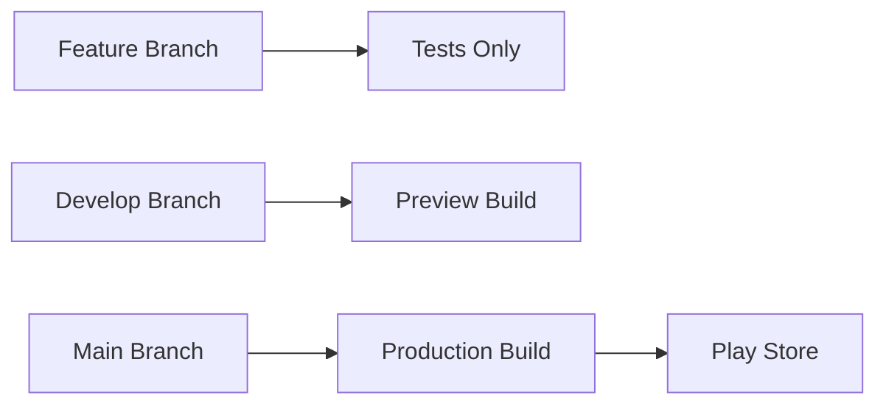

# CI/CD Quick Setup Guide

This guide helps you quickly set up the complete CI/CD pipeline for your Plateful mobile app.

## 🚀 Quick Setup Steps

### Step 1: Create GitHub Actions Workflows

You need to create these files in your repository:

```
.github/
└── workflows/
    ├── mobile-cicd.yml
    └── mobile-feature.yml
```

### Step 2: Get Your Expo Token

```bash
# Login to EAS (if not already)
eas login

# Create an access token
eas token:create --name "GitHub Actions CI/CD"
```

Copy the token that's generated.

### Step 3: Add GitHub Secrets

1. Go to your GitHub repository
2. Settings → Secrets and variables → Actions
3. Click "New repository secret"
4. Add:
   - **Name:** `EXPO_TOKEN`
   - **Value:** [paste the token from Step 2]

### Step 4: Update Your EAS Configuration

Replace your `apps/mobile/eas.json` with the enhanced version from the main guide.

### Step 5: Test the Pipeline

1. Create a feature branch:
   ```bash
   git checkout -b feature/test-cicd
   ```

2. Make a small change to your mobile app
3. Push the branch:
   ```bash
   git add .
   git commit -m "test: CI/CD pipeline setup"
   git push origin feature/test-cicd
   ```

4. Check GitHub Actions tab to see the workflow run

## 📋 Workflow Behavior

### Feature Branches (`feature/*`, `fix/*`, `hotfix/*`)
- ✅ Runs tests
- ✅ Checks build compilation
- ✅ Lints code
- ❌ No EAS build (saves build minutes)

### Develop Branch
- ✅ Runs tests
- ✅ Creates EAS preview build
- ✅ Distributes internally
- 📱 Perfect for testing new features

### Main Branch (Production)
- ✅ Runs tests
- ✅ Creates EAS production build
- ✅ Auto-submits to Play Store
- 🚀 Live deployment pipeline

## 🔧 Environment Configuration

### API Endpoints by Environment

Update your `apps/mobile/src/config/api.ts`:

```typescript
const getApiBaseUrl = () => {
  const env = process.env.NODE_ENV || 'development';
  
  const urls = {
    development: 'http://localhost:3000',
    staging: 'https://your-staging-api.vercel.app',
    production: 'https://your-production-api.vercel.app'
  };
  
  return urls[env] || urls.production;
};
```

### EAS Environment Variables

Set these for different build profiles:

```bash
# For staging/preview builds
eas secret:create --scope project --name API_BASE_URL_STAGING --value "https://your-staging-api.vercel.app"

# For production builds
eas secret:create --scope project --name API_BASE_URL_PROD --value "https://your-production-api.vercel.app"
```

## 🎯 Deployment Strategy



### Branch Strategy
- **Feature branches:** Development and testing
- **Develop:** Staging environment for internal testing
- **Main:** Production releases to Play Store

### Build Triggers
- **Push to feature branch:** Tests only
- **Push to develop:** Preview build for internal testing
- **Push to main:** Production build + Play Store submission

## 📱 Testing Your Setup

### 1. Feature Branch Test
```bash
git checkout -b feature/cicd-test
echo "// CI/CD test" >> apps/mobile/app/index.tsx
git add . && git commit -m "test: CI/CD setup"
git push origin feature/cicd-test
```
**Expected:** Tests run, no build created

### 2. Develop Branch Test
```bash
git checkout develop
git merge feature/cicd-test
git push origin develop
```
**Expected:** Tests run + Preview build created

### 3. Production Test
```bash
git checkout main
git merge develop
git push origin main
```
**Expected:** Tests run + Production build + Play Store submission

## 🔍 Monitoring Your Pipeline

### GitHub Actions
- Go to your repo → Actions tab
- Monitor workflow runs
- Check build logs for issues

### EAS Dashboard
- Visit [expo.dev](https://expo.dev)
- Go to your project
- Monitor builds in real-time

### Play Console
- Check [play.google.com/console](https://play.google.com/console)
- Monitor app submissions
- Review internal testing releases

## 🚨 Troubleshooting

### Common Issues

**1. "EXPO_TOKEN not found"**
- Check GitHub repository secrets
- Ensure token is valid: `eas whoami`

**2. "Build failed - dependencies"**
- Check package.json versions
- Ensure all dependencies are compatible

**3. "EAS project not found"**
- Verify project ID in app.json
- Check EAS login: `eas project:info`

**4. "Play Store submission failed"**
- Verify Google Service Account setup
- Check Play Console permissions

### Debug Commands

```bash
# Check EAS status
eas whoami
eas project:info

# List recent builds
eas build:list

# Check submission status
eas submission:list

# View build logs
eas build:view [build-id]
```

## 📈 Next Steps

Once your CI/CD is working:

1. **Add more tests** (unit, integration)
2. **Set up notifications** (Slack, Discord)
3. **Add iOS builds** when ready
4. **Implement feature flags**
5. **Add performance monitoring**

## 🎉 Success Criteria

Your CI/CD is working when:
- ✅ Feature branches run tests automatically
- ✅ Develop pushes create preview builds
- ✅ Main pushes create production builds
- ✅ Play Store receives automatic submissions
- ✅ Build status is visible in GitHub

---

**Time to setup:** ~30 minutes
**Time to first successful build:** ~45 minutes
**Time to Play Store submission:** ~1 hour

Your mobile app will now have the same level of automation as your Vercel backend!