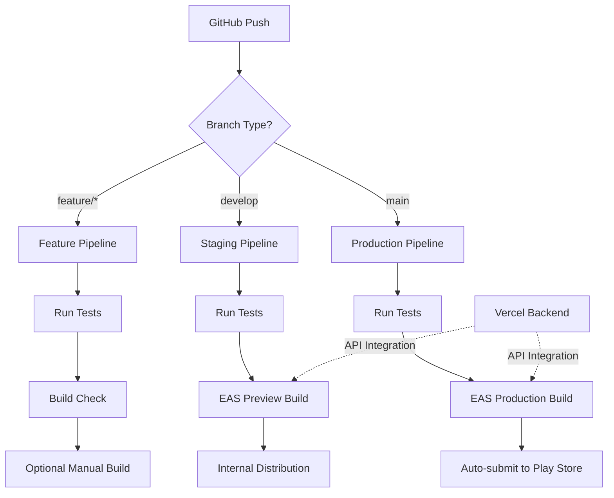

# Complete Mobile App Deployment Strategy

## 🎯 Executive Summary

I've created a comprehensive deployment strategy that takes your Plateful app from its current state to a fully automated CI/CD pipeline with Play Store publication. This strategy integrates seamlessly with your existing Vercel backend deployment.

## 📚 Documentation Package

### Core Deployment Guides
1. **[Android Play Store Deployment Guide](ANDROID_PLAY_STORE_DEPLOYMENT_GUIDE.md)** - Complete step-by-step manual deployment process
2. **[Play Store Quick Checklist](PLAY_STORE_QUICK_CHECKLIST.md)** - Quick reference for immediate deployment
3. **[Production Config Templates](PRODUCTION_CONFIG_TEMPLATES.md)** - All configuration files needed
4. **[Google Service Account Setup](GOOGLE_SERVICE_ACCOUNT_SETUP.md)** - Detailed credential setup

### CI/CD Pipeline Guides
5. **[Mobile CI/CD Pipeline Guide](MOBILE_CICD_PIPELINE_GUIDE.md)** - Complete CI/CD strategy and architecture
6. **[CI/CD Quick Setup](CICD_QUICK_SETUP.md)** - Fast-track CI/CD implementation
7. **[GitHub Workflows Templates](GITHUB_WORKFLOWS_TEMPLATES.md)** - Exact workflow files to copy/paste

## 🚀 Two Deployment Paths

### Path 1: Manual Deployment (Immediate)
**Timeline: 2-4 hours to Play Store**

1. Follow the [Play Store Quick Checklist](PLAY_STORE_QUICK_CHECKLIST.md)
2. Use [Production Config Templates](PRODUCTION_CONFIG_TEMPLATES.md) for configurations
3. Set up [Google Service Account](GOOGLE_SERVICE_ACCOUNT_SETUP.md) credentials
4. Deploy manually using EAS CLI commands

**Best for:** Getting your app live quickly, learning the process

### Path 2: CI/CD Pipeline (Automated)
**Timeline: 1-2 hours setup + automated deployments**

1. Follow the [CI/CD Quick Setup](CICD_QUICK_SETUP.md)
2. Copy workflow files from [GitHub Workflows Templates](GITHUB_WORKFLOWS_TEMPLATES.md)
3. Set up GitHub secrets and EAS credentials
4. Push to trigger automated builds and deployments

**Best for:** Long-term development, team collaboration, continuous delivery

## 🏗️ Architecture Overview

### Current State
```
✅ Expo React Native App (Plateful)
✅ EAS Project Configured
✅ Firebase Integration
✅ Vercel API Backend
✅ Android Package: com.plateful.app
```

### Target State
```
🎯 Automated CI/CD Pipeline
🎯 Branch-based Deployments
🎯 Automated Play Store Submission
🎯 Environment-specific Builds
🎯 Integrated Testing Pipeline
```

## 🔄 CI/CD Pipeline Architecture



## 🎯 Deployment Strategy

### Branch Strategy
- **`feature/*`**: Development branches with tests only
- **`develop`**: Staging environment with preview builds
- **`main`**: Production releases with Play Store submission

### Environment Configuration
- **Development**: Local API (`http://localhost:3000`)
- **Staging**: Staging API (`https://your-staging-api.vercel.app`)
- **Production**: Production API (`https://your-production-api.vercel.app`)

### Build Profiles
- **Development**: APK builds for local testing
- **Preview**: APK builds for internal distribution
- **Production**: AAB builds for Play Store

## 🔧 Implementation Checklist

### Prerequisites
- [ ] Google Play Console account ($25 one-time fee)
- [ ] EAS CLI installed and authenticated
- [ ] GitHub repository with proper access
- [ ] Vercel backend deployed and accessible

### Manual Deployment Setup
- [ ] Update EAS configuration (`eas.json`)
- [ ] Update app configuration (`app.json`)
- [ ] Set up Google Service Account credentials
- [ ] Configure environment variables
- [ ] Create production build
- [ ] Submit to Play Store

### CI/CD Pipeline Setup
- [ ] Create GitHub Actions workflows
- [ ] Set up GitHub repository secrets
- [ ] Configure EAS environment variables
- [ ] Update API configuration for environments
- [ ] Test pipeline with feature branch
- [ ] Verify automated builds work

## 📱 Expected Outcomes

### Immediate Benefits
- **Automated Builds**: No manual EAS commands needed
- **Quality Gates**: Tests run before every build
- **Environment Consistency**: Same API integration as backend
- **Fast Feedback**: Build status in GitHub commits/PRs

### Long-term Benefits
- **Continuous Delivery**: Push to deploy automatically
- **Team Collaboration**: Multiple developers can contribute safely
- **Release Management**: Controlled releases through branches
- **Monitoring**: Build and deployment visibility

## ⏱️ Timeline Expectations

### Manual Deployment
- **Setup**: 1-2 hours
- **First Build**: 15-30 minutes
- **Play Store Setup**: 1-2 hours
- **Review Process**: 1-3 days
- **Total**: 1-2 days to live app

### CI/CD Pipeline
- **Initial Setup**: 1-2 hours
- **First Automated Build**: 15-30 minutes
- **Pipeline Testing**: 30 minutes
- **Total**: 2-3 hours to full automation

### Ongoing Development
- **Feature Development**: Push and forget
- **Staging Deployment**: Automatic on develop push
- **Production Release**: Automatic on main push
- **Play Store Update**: Automatic submission

## 🛡️ Security & Best Practices

### Credentials Management
- EAS handles app signing automatically
- Google Service Account keys stored securely
- Environment variables managed through EAS secrets
- GitHub secrets for CI/CD authentication

### Code Quality
- Automated testing before builds
- TypeScript type checking
- Linting and code formatting
- Build verification on all branches

### Deployment Safety
- Branch protection rules recommended
- Preview builds for testing
- Internal testing before production
- Rollback capability through Play Console

## 🎉 Success Criteria

Your deployment strategy is successful when:

### Technical Metrics
- ✅ Build success rate > 95%
- ✅ Build time < 20 minutes
- ✅ Deployment frequency: daily (develop), weekly (production)
- ✅ Zero manual intervention for standard releases

### Business Metrics
- ✅ App available on Google Play Store
- ✅ Users can download and use the app
- ✅ API integration works in production
- ✅ Updates deploy automatically

## 🚀 Next Steps

### Immediate Actions
1. **Choose your path**: Manual deployment or CI/CD pipeline
2. **Follow the guides**: Use the appropriate documentation
3. **Set up credentials**: Google Service Account and EAS tokens
4. **Test thoroughly**: Verify everything works before going live

### Future Enhancements
- **iOS deployment**: Extend to Apple App Store
- **Feature flags**: Control feature rollouts
- **Analytics integration**: Monitor app usage
- **Crash reporting**: Track and fix issues
- **Performance monitoring**: Optimize app performance

## 📞 Support Resources

### Documentation
- **EAS Documentation**: https://docs.expo.dev/build/introduction/
- **Google Play Console**: https://play.google.com/console
- **GitHub Actions**: https://docs.github.com/en/actions

### Dashboards
- **Expo Dashboard**: https://expo.dev (monitor builds)
- **Play Console**: https://play.google.com/console (manage releases)
- **Vercel Dashboard**: https://vercel.com/dashboard (API backend)
- **GitHub Actions**: Your repo → Actions tab (CI/CD monitoring)

---

**Your Plateful app is now ready for professional deployment with enterprise-grade CI/CD automation that matches your Vercel backend setup!**

## 📋 Quick Start Commands

### For Manual Deployment
```bash
cd apps/mobile
eas login
eas build --platform android --profile production
eas submit --platform android --profile production
```

### For CI/CD Setup
```bash
mkdir -p .github/workflows
# Copy workflow files from templates
git add .github/
git commit -m "feat: add mobile CI/CD"
git push origin main
```

Choose your path and start deploying! 🚀