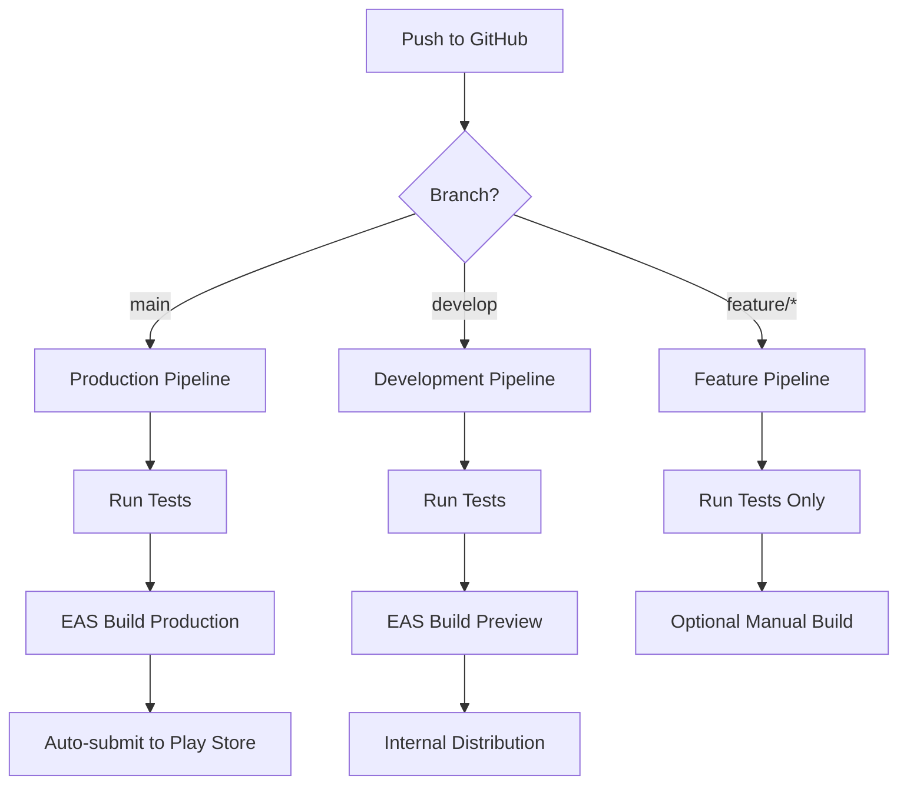

# Mobile CI/CD Pipeline Setup Guide

This guide sets up a complete CI/CD pipeline for your Plateful mobile app using GitHub Actions and EAS Build, integrating with your existing Vercel backend deployment.

## 🎯 CI/CD Strategy Overview

Your pipeline will support:
- **Automated builds** on push to specific branches
- **Branch-based deployments** (development, staging, production)
- **Automated testing** before builds
- **Play Store submission** for production releases
- **Integration** with your existing Vercel backend CI/CD

## 📋 Pipeline Architecture



## 🔧 Implementation Steps

### Step 1: GitHub Actions Workflow Files

Create these workflow files in `.github/workflows/`:

#### 1.1 Main CI/CD Workflow (`mobile-cicd.yml`)

```yaml
name: Mobile CI/CD Pipeline

on:
  push:
    branches: [main, develop]
    paths:
      - 'apps/mobile/**'
      - 'packages/**'
      - '.github/workflows/mobile-cicd.yml'
  pull_request:
    branches: [main, develop]
    paths:
      - 'apps/mobile/**'
      - 'packages/**'

jobs:
  test:
    name: Run Tests
    runs-on: ubuntu-latest
    steps:
      - name: 🏗 Setup repo
        uses: actions/checkout@v4

      - name: 🏗 Setup Node
        uses: actions/setup-node@v4
        with:
          node-version: 18.x
          cache: npm

      - name: 📦 Install dependencies
        run: npm ci

      - name: 🧪 Run tests
        run: |
          npm run test --workspace=packages/shared
          npm run type-check --workspace=apps/mobile

      - name: 🔍 Lint code
        run: |
          npm run lint --workspace=apps/mobile --if-present

  build-preview:
    name: EAS Build (Preview)
    runs-on: ubuntu-latest
    needs: test
    if: github.ref == 'refs/heads/develop' && github.event_name == 'push'
    steps:
      - name: 🏗 Setup repo
        uses: actions/checkout@v4

      - name: 🏗 Setup Node
        uses: actions/setup-node@v4
        with:
          node-version: 18.x
          cache: npm

      - name: 🏗 Setup EAS
        uses: expo/expo-github-action@v8
        with:
          eas-version: latest
          token: ${{ secrets.EXPO_TOKEN }}

      - name: 📦 Install dependencies
        run: npm ci

      - name: 🚀 Build on EAS
        run: |
          cd apps/mobile
          eas build --platform android --profile preview --non-interactive --no-wait
        env:
          EXPO_TOKEN: ${{ secrets.EXPO_TOKEN }}

  build-production:
    name: EAS Build (Production)
    runs-on: ubuntu-latest
    needs: test
    if: github.ref == 'refs/heads/main' && github.event_name == 'push'
    steps:
      - name: 🏗 Setup repo
        uses: actions/checkout@v4

      - name: 🏗 Setup Node
        uses: actions/setup-node@v4
        with:
          node-version: 18.x
          cache: npm

      - name: 🏗 Setup EAS
        uses: expo/expo-github-action@v8
        with:
          eas-version: latest
          token: ${{ secrets.EXPO_TOKEN }}

      - name: 📦 Install dependencies
        run: npm ci

      - name: 🚀 Build on EAS
        run: |
          cd apps/mobile
          eas build --platform android --profile production --non-interactive --no-wait
        env:
          EXPO_TOKEN: ${{ secrets.EXPO_TOKEN }}

  submit-production:
    name: Submit to Play Store
    runs-on: ubuntu-latest
    needs: build-production
    if: github.ref == 'refs/heads/main' && github.event_name == 'push'
    steps:
      - name: 🏗 Setup repo
        uses: actions/checkout@v4

      - name: 🏗 Setup Node
        uses: actions/setup-node@v4
        with:
          node-version: 18.x
          cache: npm

      - name: 🏗 Setup EAS
        uses: expo/expo-github-action@v8
        with:
          eas-version: latest
          token: ${{ secrets.EXPO_TOKEN }}

      - name: 📦 Install dependencies
        run: npm ci

      - name: 🚀 Submit to Play Store
        run: |
          cd apps/mobile
          eas submit --platform android --profile production --non-interactive
        env:
          EXPO_TOKEN: ${{ secrets.EXPO_TOKEN }}
```

#### 1.2 Feature Branch Workflow (`mobile-feature.yml`)

```yaml
name: Mobile Feature Branch

on:
  push:
    branches:
      - 'feature/**'
      - 'fix/**'
      - 'hotfix/**'
    paths:
      - 'apps/mobile/**'
      - 'packages/**'

jobs:
  test:
    name: Run Tests
    runs-on: ubuntu-latest
    steps:
      - name: 🏗 Setup repo
        uses: actions/checkout@v4

      - name: 🏗 Setup Node
        uses: actions/setup-node@v4
        with:
          node-version: 18.x
          cache: npm

      - name: 📦 Install dependencies
        run: npm ci

      - name: 🧪 Run tests
        run: |
          npm run test --workspace=packages/shared
          npm run type-check --workspace=apps/mobile

      - name: 🔍 Lint code
        run: |
          npm run lint --workspace=apps/mobile --if-present

  build-check:
    name: Build Check
    runs-on: ubuntu-latest
    needs: test
    steps:
      - name: 🏗 Setup repo
        uses: actions/checkout@v4

      - name: 🏗 Setup Node
        uses: actions/setup-node@v4
        with:
          node-version: 18.x
          cache: npm

      - name: 📦 Install dependencies
        run: npm ci

      - name: 🔨 Check build
        run: |
          cd apps/mobile
          npm run build

      - name: 💬 Comment PR
        uses: actions/github-script@v7
        if: github.event_name == 'pull_request'
        with:
          script: |
            github.rest.issues.createComment({
              issue_number: context.issue.number,
              owner: context.repo.owner,
              repo: context.repo.repo,
              body: '✅ Mobile app build check passed! Ready for EAS build when merged.'
            })
```

### Step 2: Enhanced EAS Configuration

Update your `apps/mobile/eas.json` for CI/CD:

```json
{
  "cli": {
    "version": ">= 16.23.0",
    "appVersionSource": "remote"
  },
  "build": {
    "development": {
      "developmentClient": true,
      "distribution": "internal",
      "android": {
        "buildType": "apk"
      },
      "env": {
        "NODE_ENV": "development"
      }
    },
    "preview": {
      "distribution": "internal",
      "android": {
        "buildType": "apk"
      },
      "env": {
        "NODE_ENV": "staging"
      },
      "channel": "preview"
    },
    "production": {
      "autoIncrement": true,
      "android": {
        "buildType": "aab",
        "gradleCommand": ":app:bundleRelease"
      },
      "env": {
        "NODE_ENV": "production"
      },
      "channel": "production"
    }
  },
  "submit": {
    "production": {
      "android": {
        "serviceAccountKeyPath": "./google-play-service-account.json",
        "track": "internal",
        "releaseStatus": "draft"
      }
    }
  }
}
```

### Step 3: GitHub Repository Secrets

Add these secrets to your GitHub repository (Settings → Secrets and variables → Actions):

```
EXPO_TOKEN=your_expo_access_token
```

To get your Expo token:
```bash
eas whoami
# If not logged in: eas login
# Then: eas token:create
```

### Step 4: Environment-Specific Configuration

#### 4.1 Update `app.json` for CI/CD

```json
{
  "expo": {
    "name": "Plateful",
    "slug": "plateful",
    "owner": "kingeli1221",
    "version": "1.0.0",
    "orientation": "portrait",
    "icon": "./assets/logo-circle.png",
    "userInterfaceStyle": "automatic",
    "splash": {
      "image": "./assets/logo-full.png",
      "resizeMode": "contain",
      "backgroundColor": "#ffffff"
    },
    "assetBundlePatterns": ["**/*"],
    "android": {
      "adaptiveIcon": {
        "foregroundImage": "./assets/logo-circle.png",
        "backgroundColor": "#ffffff"
      },
      "package": "com.plateful.app",
      "versionCode": 1,
      "compileSdkVersion": 34,
      "targetSdkVersion": 34,
      "permissions": [
        "INTERNET",
        "CAMERA",
        "READ_EXTERNAL_STORAGE",
        "WRITE_EXTERNAL_STORAGE",
        "ACCESS_NETWORK_STATE"
      ],
      "splash": {
        "image": "./assets/logo-full.png",
        "resizeMode": "contain",
        "backgroundColor": "#ffffff"
      },
      "googleServicesFile": "./google-services.json",
      "allowBackup": false
    },
    "plugins": [
      "expo-router",
      "expo-font",
      [
        "@react-native-google-signin/google-signin",
        {
          "iosUrlScheme": "com.plateful.app"
        }
      ]
    ],
    "extra": {
      "router": {},
      "eas": {
        "projectId": "e1d8f620-391d-4941-84a2-4ebbcbbd7f8e"
      },
      "apiBaseUrl": {
        "development": "http://localhost:3000",
        "staging": "https://your-staging-api.vercel.app",
        "production": "https://your-production-api.vercel.app"
      }
    },
    "updates": {
      "url": "https://u.expo.dev/e1d8f620-391d-4941-84a2-4ebbcbbd7f8e"
    },
    "runtimeVersion": {
      "policy": "appVersion"
    }
  }
}
```

#### 4.2 Environment-Aware API Configuration

Update `apps/mobile/src/config/api.ts`:

```typescript
import Constants from 'expo-constants';

const getApiBaseUrl = () => {
  const env = process.env.NODE_ENV || Constants.expoConfig?.extra?.env || 'development';
  
  const urls = Constants.expoConfig?.extra?.apiBaseUrl || {
    development: 'http://localhost:3000',
    staging: 'https://your-staging-api.vercel.app',
    production: 'https://your-production-api.vercel.app'
  };
  
  return urls[env] || urls.production;
};

export const API_BASE_URL = getApiBaseUrl();

export const API_ENDPOINTS = {
  CHAT: `${API_BASE_URL}/api/chat`,
  RECIPE: `${API_BASE_URL}/api/recipe`,
  GENERATE_RECIPE: `${API_BASE_URL}/api/generate-recipe`,
  EXTRACT_INTENT: `${API_BASE_URL}/api/extract-intent`,
  HEALTH: `${API_BASE_URL}/api/health`,
};

// Debug logging in development
if (__DEV__) {
  console.log('API Configuration:', {
    environment: process.env.NODE_ENV,
    baseUrl: API_BASE_URL,
    endpoints: API_ENDPOINTS
  });
}
```

### Step 5: Package.json Scripts Update

Add CI/CD scripts to `apps/mobile/package.json`:

```json
{
  "scripts": {
    "start": "expo start",
    "dev": "expo start --dev-client",
    "android": "expo run:android",
    "ios": "expo run:ios",
    "web": "expo start --web",
    "build": "expo export",
    "build:development": "eas build --platform android --profile development",
    "build:preview": "eas build --platform android --profile preview",
    "build:production": "eas build --platform android --profile production",
    "submit:production": "eas submit --platform android --profile production",
    "update:preview": "eas update --branch preview",
    "update:production": "eas update --branch production",
    "type-check": "tsc --noEmit",
    "lint": "eslint . --ext .ts,.tsx --fix",
    "test": "jest",
    "clean": "rimraf .expo"
  }
}
```

## 🚀 Deployment Strategy

### Branch Strategy

- **`main`** → Production builds → Auto-submit to Play Store
- **`develop`** → Preview builds → Internal distribution
- **`feature/*`** → Tests only → Manual build option

### Build Triggers

- **Push to `main`**: Triggers production build and Play Store submission
- **Push to `develop`**: Triggers preview build for internal testing
- **Push to `feature/*`**: Runs tests and build checks only
- **Pull Requests**: Runs tests and provides build status

### Environment Variables

Set these in EAS for different environments:

```bash
# Development
eas secret:create --scope project --name API_BASE_URL_DEV --value "http://localhost:3000"

# Staging
eas secret:create --scope project --name API_BASE_URL_STAGING --value "https://your-staging-api.vercel.app"

# Production
eas secret:create --scope project --name API_BASE_URL_PROD --value "https://your-production-api.vercel.app"
```

## 📊 Monitoring and Notifications

### Build Status Notifications

Add Slack/Discord notifications to your workflows:

```yaml
- name: 📱 Notify build status
  if: always()
  uses: 8398a7/action-slack@v3
  with:
    status: ${{ job.status }}
    text: 'Mobile build ${{ job.status }} for ${{ github.ref }}'
  env:
    SLACK_WEBHOOK_URL: ${{ secrets.SLACK_WEBHOOK }}
```

### Build Monitoring

- Monitor builds in EAS dashboard
- Set up alerts for failed builds
- Track build times and success rates

## 🔄 Integration with Vercel Backend

Your mobile CI/CD will work alongside your existing Vercel deployment:

1. **Backend changes** trigger Vercel deployment
2. **Mobile changes** trigger EAS builds
3. **Both** can be triggered by monorepo changes
4. **Environment consistency** across backend and mobile

## 🧪 Testing Strategy

### Automated Tests

- **Unit tests** for shared packages
- **Type checking** for TypeScript
- **Linting** for code quality
- **Build verification** for all branches

### Manual Testing

- **Preview builds** for `develop` branch
- **Internal testing** via Play Console
- **Production testing** before public release

## 📈 Scaling Considerations

### Future Enhancements

- **iOS builds** when ready
- **Automated screenshot testing**
- **Performance monitoring**
- **Crash reporting integration**
- **A/B testing setup**

### Cost Optimization

- **Build caching** to reduce build times
- **Conditional builds** based on changed files
- **Parallel builds** for different platforms
- **Build scheduling** for off-peak hours

## 🎯 Success Metrics

Track these metrics for your CI/CD pipeline:

- **Build success rate** (target: >95%)
- **Build time** (target: <15 minutes)
- **Deployment frequency** (daily for develop, weekly for production)
- **Time to recovery** (target: <2 hours)

---

This CI/CD pipeline will give you automated, reliable deployments that scale with your development workflow while maintaining high quality and security standards.